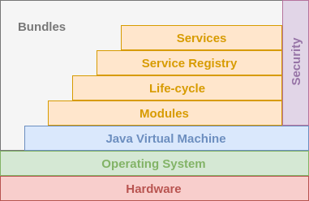

## OWT-2: SOA using OSGi and Apache Karaf

[TOC]


## Introduction - from monolithic to modular


## Monolithic architecture

In software engineering, a monolithic architecture has been used to describe a single-tiered application in which all MVC components are combined into a single program within a single platform. A monolithic application is self-contained, and independent from other applications.
Monolithic application can be considered as a big container where in all components of the application are assembled together and tightly packaged in various formats such as EAR, WAR, JAR etc. Which is finally deployed as a single unit on the application server.


### Monolithic architectures drawback

Monolithic services tend to get tightly coupled and entangled as the application evolves, making it difficult to isolate services for purposes such as independency scaling or maintenance. Monolithic architectures are also much harder to understand, because there may be dependencies, side-effects etc which are not obvious when you’re looking at a particular service or controller.

Aspects where monolithic architectures are not doing well:

#### Agility

In a monolithic application even if a small component in an application has to be changed, the entire application needs to be repackaged and assembled together.

#### Scalability

Service-wise, while some resources are utilized other services in the same application sare getting wasted since they don’t have a need to scale.

#### DevOps Cycle

In any case of Continuous delivery, a monolithic application even for a small change in the application, application delivery time increases tremendously and it definitely decreases frequency of Deployments.

#### Availability

If one service fails under monolithic application wherein entire application has to be brought down.

Fault Tolerance When a specific service is under heavy pressure it brings the whole application down with it. For instance in cases when Database connection pool is getting exhausted the entire application bogging down.


The answer to [Monolithic architectures drawback ](path), is not to rip and replace systems or applications, nor to completely renovate them, but rather to find a way to leverage existing software investments so that overall organizational goals are effectively supported. That solution is to eliminate dependencies and enable quick testing and deployment of code changes, greater modularity, loose coupling and all hold promise in simplifying the integration task. In other words modular Architecture. Modular orientation helps to accomplish these goals by making systems more responsive to business needs, simpler to develop and easier to maintain and manage. Implementing a solution architecture based upon modularity helps organizations plan ahead for change, rather than responding reactively.
 

## OSGi

Java only supports the usage of access modifiers, but every public class can be called from another software component. What is desired is a way to explicitly define the API of a software component. The OSGi specification fills this gap

>The OSGi specification describes a modular system and a service platform for the Java programming language that implements a complete and dynamic component model, something that does not exist in standalone Java/VM environments. Applications or components, coming in the form of bundles for deployment, can be remotely installed, started, stopped, updated, and uninstalled without requiring a reboot; management of Java packages/classes is specified in great detail. Application life cycle management is implemented via APIs that allow for remote downloading of management policies. The service registry allows bundles to detect the addition of new services, or the removal of services, and adapt accordingly.

The OSGi Specifications can be obtained from [here](http://www.osgi.org/Specifications/HomePage).


## OSGi implementations

`Apache Felix, Eclipse Equinox, Knopflerfish, ProSyst.`

The OSGi standards are defined in the OSGi Alliance and published in OSGi specification documents such as the Core and Compendium specifications. These specifications contain chapters each of which describe a specific OSGi standard. This page contains most popular implementations of OSGi standards, both commercial and open source implementations are included.
Implementations realize specification chapter(s) from the OSGi specification documents.

`image pending`

### Apache Felix


> Apache Felix is an open source implementation of the OSGi Release 5 core framework specification. The initial codebase was donated from the Oscar project at ObjectWeb.The developers worked on Felix for a full year and have made various improvements while retaining the original footprint and performance. On June 21, 2007, the project graduated from incubation as a top level project and is considered the smallest size software at Apache Software Foundation.


### Eclipse Equinox


> Equinox is a sub-project of the Eclipse project that provides a certified implementation of the OSGi R4.x core framework specification .It is a module runtime that allows developers to implement an application as a set of "bundles" using the common services infrastructure.
Equinox began as a project to replace the original Eclipse plug-in runtime in version 3.0 of Eclipse (c. 2004). The open source project was seeded with code donated by IBM's Service Management Framework (SMF) product. It was further developed to meet the needs of the Eclipse community. The adaptations were made into the OSGi specification process, with many being incorporated in the R4 release of the OSGi framework specification. Since then, Equinox has been the reference implementation for the OSGi framework specification.


### Knopflerfish
http://www.knopflerfish.org


Knopflerfish  OSGi Framework  (open source and enterprise editions )

The Knopflerfish R6 OSGi framework and related Services is implemented in accordance with the OSGi R6 specification. The numbering for the OSGi defined components refer to the OSGi specification chapter numbering. Version refer the version of the particular specification in the OSGi Core Specification

Knopflerfish Pro is Makewave’s certified release 4, version 4.2 compliant OSGi service platform, based directly on the open source Knopflerfish OSGi distribution. Knopflerfish Pro is a fully supported product, intended for professional use, and gives companies the assurance required to use open source software in commercial systems. Knopflerfish Pro extends open source Knopflerfish by adding a set of bundles only available in the Pro version, making Knopflerfish Pro a complete implementation of the OSGi Release 4, version 4.2 specifications. This includes the OSGi defined UPnP services as well as the residential and mobile management services, e.g. DMT Admin.


### ProSyst

ProSyst is a OSGi implementation targeting embedded devices. Currently supported by Bosch Software Innovations.


## OSGi basics




OSGi conceptual layers

### OSGi conceptual layers

OSGi framework architecture consists three conceptual layers. Each layer is dependent on the layer(s) beneath it. The diagram below describe the overview of each layer.


##### Module layer

Module layer defines OSGi module concept - bundle, which is a JAR file with extra metadata. A bundle contains class files and related resources such as images, xml files. Through [manifest.mf metadata file](path TBD ), Module layer declare which contained packages in JAR file are visible to outside, and declare on which external packages the bundle depend.


##### Lifecycle layer

This layer defines how bundles are dynamically installed and managed in the OSGi framework. It provides a way for a bundle to gain access to the underlying OSGi framework. If OSGi were a car, module layer would provide modules such as tire, seat, etc, and the lifecycle layer would provide electrical wiring which makes the car run.

 ##### Service layer

In this layer, service providers publish services to service registry, while service clients search the registry to find available services to use. This is like a service-oriented architecture (SOA) which has been largely used in web services. Here OSGi services are local to a single VM, so it is sometimes called SOA in a VM.


### OSGi Bundles

>A OSGi Bundle is a group of Java classes and additional resources equipped with a detailed manifest MANIFEST.MF file on all its contents, as well as additional services needed to give the included group of Java classes more sophisticated behaviors, to the extent of deeming the entire aggregate a component.

The OSGi spec describes the OSGi Bundle as a **unit of modularization** that is comprised of Java classes and other resources which together can provide functions to end users.

 A OSGi Bundle is a JAR file that contains a manifest file describing the contents of the JAR file and providing information about the bundle. Can contain optional documentation in the OSGI-OPT directory of the JAR file or one of its sub-directories. In short, a bundle = jar + OSGI information (specified in the JAR manifest file - META-INF/MANIFEST.MF), no extra files or predefined folder layout are required. This means that all it takes to create a bundle from a jar, is to add some entries to the JAR manifest.

A OSGi Bundle is
- The standard deployment unit of OSGi
- Versioned
- Declarative dependencies specification


#### Bundle Manifests

 In addition to the headers that can be defined for a non-OSGi JAR or WAR file, the bundle manifest file for an OSGi bundle contains OSGi-specific headers. The metadata that is specified in these headers enables the OSGi Framework to process the modular aspects of the
 bundle.

 


OSGi Bundles may define
- Libraries / SDKs
- REST endpoints
- Web Applications
- Services
- Extensions for other bundles

Most IDEs provide auto generation mechanisms for manifests but also convenient editors where developer may edit the manifest file.


### Bundle life-cycle

OSGi is a dynamic platform. This means that bundles may be installed, started, updated, stopped, and uninstalled at any time during the running of the framework.

OSGi Bundle Status|Description
----|----------
INSTALLED|The bundle has been installed into the OSGi container, but some of the bundle's dependencies have not yet been met. The bundle requires packages that have not been exported by any currently installed bundle.
RESOLVED|The bundle is installed, and the OSGi system has connected up all the dependencies at a class level and made sure they are all resolved. The bundle is ready to be started. If a bundle is started and all of the bundle's dependencies are met, the bundle skips this state.
STARTING|A temporary state that the bundle goes through while the bundle is starting, after all dependencies have been resolved.
ACTIVE|The bundle is running.
STOPPING|A temporary state that the bundle goes through while the bundle is stopping.
UNINSTALLED|The bundle has been removed from the OSGi container.


## Start levels

Start level is a priority number that is assigned to bundles. The framework itself also has a certain start level, and only bundles with a start level lower than or equal to that of the framework will actually be active. Bundles with a start level higher than that of the framework will not be active. You can however tell such a bundle to become active as soon as the framework reaches this start level. That’s usually described as “persistently started”. When the framework starts up, it will go through the start levels one by one until it reaches the target start level. That means that by assigning start levels to bundles, you can determine their startup order. By the way, if multiple bundles share the same start level, there is no guarantee in what order they will start, neither the order they will finish.


There are however two things to keep in mind:

- The start level service is optional and when it’s not present there is no control over the startup order.
- There must be no dependency on the presence of a service that was published by a bundle with a lower start level, since Services are dynamic.
- when a bundle is updated, its services are ``resolved`` for a short while.


There are a couple of testing modes for start levels:

- Diagnostics mode
A higher start level than normal that will active extra bundles that add monitoring or debugging functionality. The start level, as always, will be set by the management agent whenever something goes wrong that needs further analysis.

- Power save mode
For embedded applications, a special power save start level could disable all bundles that are not necessary in that mode. F


High priority features

There are some bundles that should be started early in the startup process, such as a logging service, or a splash screen. That is accomplished by setting such bundles a low start level.


## OSGi Services

>An OSGi service is a java object instance, registered into an OSGi framework with a set of properties. Any java object can be registered as a service, but typically it implements a well-known interface.

The first step of the definition of an OSGi service is the declaration of the class or interface to the corresponding service. This is called the service interface. The second step is the creation of the implementation class for the service interface. OSGi provides a central service registry which allows developers to register services implementations and consume existing services via the OSGi runtime. A service can be dynamically started and stopped, and plug-ins which use services must be able to handle this dynamic behavior. The plug-ins can register listeners to be informed if a service is started or stopped. During the declaration of a service it is possible to specify key / values which can be used to configure the service. It is possible to define a [Start level](REF TBD) for a service via a service property. Services can "come and go" and applications using them will not break, can be replaced/updated in runtime without affecting their consumers Services, like everything else in OSGi, are versioned


An OSGi Service is:
- A contract and one (ore more) implementations of that contract.
- Real-time appearance, disappearance, replacement.
- Dynamic binding
- apps don't break if a service is not available.
- LDAP-like querying capabilities
- Implement the SOA paradigm
- Publish-Find-Subscribe pattern
- Service Registry is kept by OSGi
- Clients perform lookup in the registry
- Promotes interface-driven development
- A contract between Producer and Consumer

 

### Registering services using declarative registration

For declarative registration  quite a few frameworks/tools available the most popular are DS, iPOJO, Blueprint. There is no clear answer which one is better. In this document we will demonstrate Blueprint.

The Blueprint Container specification defines a dependency injection framework for OSGi. It is designed to deal with the dynamic nature of OSGi, where services can become available and unavailable at any time. The specification is also designed to work with plain old Java objects (POJOs) so that the same objects can be used within and outside the OSGi framework. The Blueprint XML files that define and describe the various components of an application are key to the Blueprint programming model. The specification describes how the components get instantiated and wired together to form a running application.
OSGi blueprint


```
<?xml version="1.0" encoding="UTF-8"?>
<blueprint xmlns=”http://www.osgi.org/xmlns/blueprint/v1.0.0”>
    ...
</blueprint>
```

### Registering services using annotations
 
To register services using annotation the usage of `blueprint-maven-plugin` is required.

A service registration with annotations example:
```
import org.ops4j.pax.cdi.api.OsgiServiceProvider;
import javax.inject.Singleton;

@Singleton
@OsgiServiceProvider(classes = {AService.class})
public class AServiceImpl implements AService {
...   
```


# OSGi Karaf


 

>Apache Karaf is a modern and polymorphic container.
Karaf can be used standalone as a container, supporting a wide range of applications and technologies. It also supports the "run anywhere" (on any machine with Java, cloud, docker images, …​) using the embedded mode.
It’s a lightweight, powerful, and enterprise ready platform.
With this flexibility, Karaf is the perfect solution for microservices, systems integration, big data, and much more.
Apache Karaf is powered by OSGi (but you don’t need to know what OSGi is to use Karaf).
Apache Karaf uses either the Apache Felix or Eclipse Equinox OSGi frameworks, providing additional features on top of the framework.
Apache Karaf can be scaled from a very lightweight container to a fully featured enterprise service: it’s a very flexible and extensible container, covering all the major needs.


### Karaf features
Apache Karaf provides a simple and flexible way to provision applications. In Apache Karaf, the application provisioning is an Apache Karaf feature. When a feature is being installed, Apache Karaf installs all resources described in the feature. It means that it will automatically resolves and installs all bundles, configurations, and dependency features described in the feature.

A feature describes an application as:
- a name
- a version
- a optional description (eventually with a long description)
- a set of bundles
- optionally a set configurations or configuration files
- optionally a set of dependency features


### Karaf Enterprise features
  Karaf as is delivered, already, has more features than the vanilla osgi environment. In addition to those there are more out of the box:
   


Karaf shell
- Text-based administration console
- Default interface when Karaf boots up
- Useful to debug and view logs
- You can connect to a background-running, local Karaf via ./bin/client. •


### Karaf installation

(Windows)

from http://karaf.apache.org/download.html
download the Binary Distribution zip
select a folder and extract it, that folder will be the Karaf-home

Then open a cmd client and navigate to the {karaf home}\bin  path and execute:

D:\apache-karaf-4.1.1\bin

and run karaf.bat


To acces Karaf logger

from the Karaf home  folder :
tail -F data\log\karaf.log

> feature:install webconsole

```


Navigate to [default webconsole page](http://localhost:8181/system/console/bundles)

Authentication required , the Default user name /password is :
       karaf / karaf

Optionally it can be modified : at
{KARAF_HOME}\etc\users.properties

http://localhost:8181/system/console/bundles

After the successful log in :


## Deploying bundles on Karaf

### Deploy a sample application
While you will learn in the Karaf user’s guide how to fully use and leverage Apache Karaf, let’s install a sample application for now:

Clone and build the OWT2 code.

Add bundle's repo:

    feature:repo-add mvn:com.owt2.demo/features/1.0.0-SNAPSHOT/xml/features
   

Install prerequisites:

install -s wrap:mvn:javax.inject/javax.inject/1

Install bundle
bundle:install -s mvn:com.owt2.demo/bundle-101/1.0.0-SNAPSHOT


        __ __                  ____
       / //_/____ __________ _/ __/
      / ,<  / __ `/ ___/ __ `/ /_
     / /| |/ /_/ / /  / /_/ / __/
    /_/ |_|\__,_/_/   \__,_/_/

  Apache Karaf (4.1.1)

Hit '<tab>' for a list of available commands
and '[cmd] --help' for help on a specific command.
Hit '<ctrl-d>' or type 'system:shutdown' or 'logout' to shutdown Karaf.

karaf@root()> feature:repo-add mvn:com.owt2.demo/features/1.0.0-SNAPSHOT/xml/features
Adding feature url mvn:com.owt2.demo/features/1.0.0-SNAPSHOT/xml/features
karaf@root()> install -s wrap:mvn:javax.inject/javax.inject/1
Bundle ID: 52
karaf@root()> bundle:install -s mvn:com.owt2.demo/bundle-101/1.0.0-SNAPSHOT
A new Bundle has started!
Bundle ID: 53
karaf@root()>


